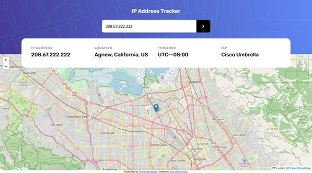
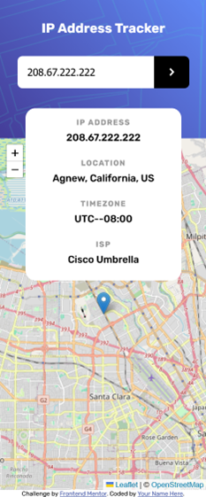

# Frontend Mentor - IP address tracker solution

This is a solution to the [IP address tracker challenge on Frontend Mentor](https://www.frontendmentor.io/challenges/ip-address-tracker-I8-0yYAH0). Frontend Mentor challenges help you improve your coding skills by building realistic projects. 

## Overview

### The challenge

Users should be able to:

- View the optimal layout for each page depending on their device's screen size
- See hover states for all interactive elements on the page
- See their own IP address on the map on the initial page load
- Search for any IP addresses or domains and see the key information and location

### Screenshot

### Links

- Solution URL: [https://github.com/toshirokubota/ip-address-tracker](https://github.com/toshirokubota/ip-address-tracker)
- Live Site URL: [https://toshirokubota.github.io/ip-address-tracker/](https://toshirokubota.github.io/ip-address-tracker/)

## My process

### Built with

- Semantic HTML5 markup
- CSS custom properties
- Flexbox
- Mobile-first workflow

### What I learned

I was able to integrate both IPify and leaflet.js into my project. Both libraries were easy to use and have good documentations.

### Continued development

I want to get more comfortable with promises and asynchronous programming. I often find myself thinking in synchronous ways and run into some issues interacting with promises.

### Useful resources

I googled for some famous static ip addresses and found this quora post.
https://www.quora.com/What-are-some-famous-IP-addresses. I used them to test the app.

## Author

- Frontend Mentor - [@toshirokubota](https://www.frontendmentor.io/profile/toshirokubota)
